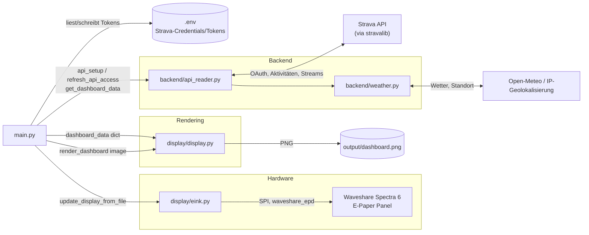
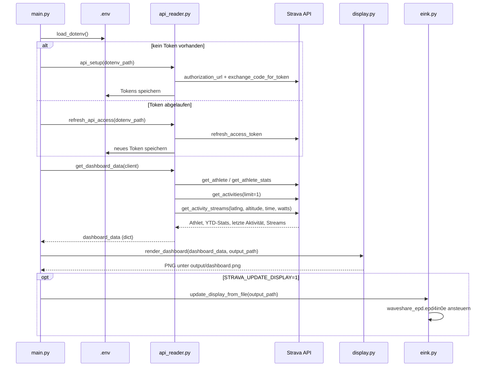

# Strava E-Paper Dashboard

Rendert die letzte Strava-Aktivität und die Jahresstatistik als 600×400px-Bild
und zeigt es auf einem Waveshare Spectra-6-E-Paper-Display an (oder speichert
es nur als PNG, falls kein Display angeschlossen ist).

## Inhalt

- [Architektur](#architektur)
- [Abhängigkeiten](#abhängigkeiten)
- [Datenfluss](#datenfluss-ein-programmlauf)
- [Projektstruktur](#projektstruktur)
- [Hardware-Setup](#hardware-setup)
  - [Raspberry Pi im lokalen Netz finden und per SSH verbinden](#raspberry-pi-im-lokalen-netz-finden-und-per-ssh-verbinden)
    - [Automatisches Update alle 10 Minuten](#automatisches-update-alle-10-minuten)
    - [Automatisches Deployment neuer Releases](#automatisches-deployment-neuer-releases)
    - [Manuelle Git-Befehle auf dem Pi](#manuelle-git-befehle-auf-dem-pi)
- [Lokal testen](#lokal-testen-ohne-display)
- [Modulreferenz](#modulreferenz)
  - [`main.py`](#mainpy)
  - [`backend/api_reader.py`](#backendapi_readerpy)
    - [`backend/weather.py`](#backendweatherpy)
  - [`backend/version.py`](#backendversionpy)
  - [`display/display.py`](#displaydisplaypy)
  - [`display/eink.py`](#displayeinkpy)
- [Design-Hinweise: Farben auf der 6-Farb-Palette](#design-hinweise-farben-auf-der-6-farb-palette)

---

## Architektur



**Verantwortlichkeiten:**

| Modul | Zuständigkeit |
| ------------------------ | ------------- |
| `main.py` | Orchestriert den Ablauf: Auth-Status prüfen, Daten holen, Bild rendern, optional aufs Display schreiben. |
| `backend/api_reader.py` | Strava-API-Zugriff (`stravalib`) sowie Aufbereitung von Aktivitäten, Routen, Power und Kudos. |
| `backend/weather.py` | Ermittelt den Pi-Standort und lädt Temperatur, Wind und Niederschlagsprognose von Open-Meteo. |
| `display/display.py` | Baut aus dem Daten-`dict` ein PIL-Bild für die feste 6-Farben-E-Ink-Palette. Kein Netzwerkzugriff. |
| `display/eink.py` | Dünner Treiber-Wrapper, der ein fertiges Bild über die Waveshare-Bibliothek ans Panel schickt. Einziger Ort mit Hardwarezugriff. |

Die Trennung ist bewusst: `api_reader.py` und `display.py` kennen sich nicht
gegenseitig, sie kommunizieren nur über das von `get_dashboard_data()`
zurückgegebene `dict` (siehe [Datenformat](#get_dashboard_dataclient-stravalibclient-n_recent-int--1---dict)).

## Abhängigkeiten

Die Python-Laufzeit benötigt nur die drei Pakete aus [`requirements.txt`](requirements.txt):

```text
stravalib
python-dotenv
Pillow
```

Wetterdaten werden mit der Python-Standardbibliothek geladen. Für das
physische Display kommen auf dem Pi zusätzlich die Waveshare-Bibliothek sowie
`spidev`, `RPi.GPIO`, `gpiozero` und `lgpio` hinzu (die aktuelle
Waveshare-Bibliothek nutzt `gpiozero` für den GPIO-Zugriff, das wiederum
`lgpio` als Backend braucht – siehe [Raspberry Pi einrichten](#raspberry-pi-einrichten)).
Diese werden separat installiert, weil sie hardware- und systemabhängig sind.

## Datenfluss (ein Programmlauf)



## Projektstruktur

```text
strava-api-display/
├── main.py                  # Einstiegspunkt / Orchestrierung
├── backend/
│   ├── api_reader.py        # Strava-Auth + Datenabruf
│   ├── weather.py            # Pi-Standort + Wetterdaten
│   └── version.py            # Release-Label aus dem lokalen Git-Tag
├── display/
│   ├── display.py           # Bild-Rendering (PIL) für die 6-Farb-Palette
│   ├── eink.py               # Waveshare-Treiber-Wrapper
│   ├── fonts/                # Roboto (+ Condensed), Regular/Bold
│   └── img/                  # Logo und Statistik-Icons
├── deploy/                   # systemd-Units für 10-min-Timer + nächtliches Release-Update
├── output/                   # render_dashboard()-Ausgabe (gitignored)
├── .env                       # Strava-Credentials/Tokens (gitignored)
└── requirements.txt
```

## Hardware-Setup

### Display

> Waveshare Spectra 6 (E6)

[Details](https://www.waveshare.com/4inch-e-paper-hat-plus-e.htm?sku=27367)

Größe: 600×400 (4")

### Controller

> Raspberry Pi Zero W

[Details](https://www.raspberrypi.com/products/raspberry-pi-zero-w/)

Single-Core ARM1176JZF-S @ 1GHz, 512 MB RAM, **ARMv6**. Deployment läuft
deshalb nativ über eine venv (kein Docker – moderne Container-Images
unterstützen ARMv6 nicht mehr, und der Chip ist nicht 64-bit-fähig).

### Raspberry Pi im lokalen Netz finden und per SSH verbinden

Der Pi muss eingeschaltet und mit demselben lokalen Netz wie dein Rechner
verbunden sein. Die Adresse lässt sich oft direkt über den mDNS-Namen finden:

```sh
ping raspberrypi.local
ssh <pi-user>@raspberrypi.local
```

Falls der Hostname nicht aufgelöst wird, bekannte Geräte im lokalen Netz über
die ARP-Tabelle anzeigen:

```sh
arp -a
```

Alternativ kann das eigene lokale Netz ermittelt und mit `nmap` nach SSH-
Diensten durchsucht werden. `nmap` lässt sich unter macOS z. B. mit Homebrew
installieren (`brew install nmap`):

```sh
ipconfig getifaddr en0       # eigene WLAN-Adresse, z. B. 192.168.1.23
nmap -sn 192.168.1.0/24      # aktive Geräte im eigenen Netz anzeigen
nmap -p 22 --open 192.168.1.0/24
```

Die gefundene IP-Adresse anschließend für die SSH-Verbindung verwenden:

```sh
ssh <pi-user>@<pi-ip>
```

Beim ersten Verbindungsaufbau den Host-Schlüssel mit `yes` bestätigen und das
Passwort des Pi-Benutzers eingeben. Nach erfolgreicher Verbindung prüfen:

```sh
hostname
python3 --version
```

### Raspberry Pi einrichten

1. Raspberry Pi OS Lite (32-bit – das einzige Angebot für ARMv6) installieren,
   SPI in `raspi-config` aktivieren (`sudo raspi-config` → *Interface Options*
   → *SPI* → *Yes*, oder `sudo raspi-config nonint do_spi 0`) und das Display
   mit aufgesetztem HAT am GPIO-Header anschließen. **Danach neu starten** –
   ohne Neustart bleibt `/dev/spidev0.0` trotz aktivierter Einstellung nicht
   angelegt (`ls /dev/spidev*` sollte `spidev0.0` und `spidev0.1` zeigen).
2. Die offizielle Waveshare-Python-Bibliothek auf dem Pi installieren. Sie muss `waveshare_epd.epd4in0e` bereitstellen:

    ```sh
    git clone --depth 1 https://github.com/waveshareteam/e-Paper.git ~/e-Paper
    ```

    (Wird unten per `PYTHONPATH` eingebunden statt separat installiert, siehe Service-Unit.)

3. **Projekt per Git auf den Pi klonen** (statt per `rsync` zu kopieren – so
   bekommt der Pi von Anfang an einen echten Checkout, den er später auch
   selbst per Deploy-Key aktualisieren kann, siehe
   [Automatisches Deployment neuer Releases](#automatisches-deployment-neuer-releases)):

    ```sh
    ssh-keygen -t ed25519 -C "strava-display-deploy" -f ~/.ssh/strava_display_deploy -N ""
    cat ~/.ssh/strava_display_deploy.pub
    ```

    Den ausgegebenen öffentlichen Schlüssel in GitHub unter
    **Repo → Settings → Deploy keys → Add deploy key** eintragen
    (*"Allow write access"* **nicht** aktivieren – der Pi soll nur lesen).
    Danach klonen:

    ```sh
    GIT_SSH_COMMAND="ssh -i ~/.ssh/strava_display_deploy -o IdentitiesOnly=yes" \
      git clone git@github.com:jschoenau18/strava-display.git ~/strava-api-display
    ```

    Ein interaktives `git pull` im SSH-Terminal kennt diesen Deploy-Key aber
    nicht automatisch – siehe [Manuelle Git-Befehle auf dem Pi](#manuelle-git-befehle-auf-dem-pi).

4. Virtuelle Umgebung anlegen und Abhängigkeiten installieren (`spidev`/`RPi.GPIO`
   kompilieren ggf. aus dem Quellcode, dafür vorher `build-essential`/`python3-dev`
   installieren, falls das fehlschlägt):

    ```sh
    sudo apt-get install -y build-essential python3-dev python3-venv
    cd ~/strava-api-display
    python3 -m venv .venv
    .venv/bin/pip install -r requirements.txt
    .venv/bin/pip install spidev RPi.GPIO gpiozero lgpio
    ```

    Die aktuelle Waveshare-Bibliothek greift über `gpiozero` auf die GPIOs zu.
    Dessen Standard-Backend (`RPi.GPIO`) scheitert auf aktuellen Raspberry Pi
    OS-Kerneln beim `BUSY`-Pin mit `RuntimeError: Failed to add edge detection`
    (die alte sysfs-GPIO-Schnittstelle, auf der `RPi.GPIO`s Edge-Detection
    aufbaut, existiert dort nicht mehr in der gewohnten Form). Deshalb
    zusätzlich `lgpio` installieren und `gpiozero` per Umgebungsvariable
    darauf umstellen (siehe Testlauf und Service-Unit unten).

5. `.env` mit den Strava-Zugangsdaten (und – falls schon lokal verbunden – den
   bereits gültigen Tokens) ins Projektverzeichnis kopieren (z. B. per
   `scp .env <pi-user>@<pi-host>:~/strava-api-display/.env` – `.env` ist
   gitignored und kommt daher nicht über den Git-Clone mit),
   `STRAVA_UPDATE_DISPLAY=1` setzen.
6. Testlauf:

    ```sh
    GPIOZERO_PIN_FACTORY=lgpio PYTHONPATH=~/e-Paper/E-paper_Separate_Program/4inch_e-Paper_E/RaspberryPi_JetsonNano/python/lib flock -w 60 ~/strava-api-display/.dashboard.lock .venv/bin/python main.py
    ```

    Das `flock` ist kein Zufall: Sobald der Timer unten läuft, feuert er alle
    10 Minuten `main.py` im Hintergrund. Ein manueller Testlauf zur gleichen
    Zeit greift sonst auf dieselben E-Paper-GPIO-Pins zu wie der laufende
    Timer-Job und crasht mit `lgpio.error: 'GPIO busy'` – `flock` sorgt
    dafür, dass sich beide Läufe die Pins nacheinander statt gleichzeitig
    teilen (siehe [Automatisches Update alle 10 Minuten](#automatisches-update-alle-10-minuten)).

    Kein `.env` mit gültigen Tokens dabei? Dann läuft hier interaktiv der
    OAuth-Flow von `api_setup()` (Browser-Login, Code ins SSH-Terminal einfügen).

### Automatisches Update alle 10 Minuten

Die Unit-Dateien in [`deploy/`](deploy/) richten einen systemd-Timer ein, der
`main.py` alle 10 Minuten ausführt (auch ohne aktive Login-Session, mit Logs
über `journalctl`):

1. `deploy/strava-dashboard.service` geht von `jschoenau`/`/home/jschoenau/strava-api-display`
   und der Waveshare-Bibliothek unter `~/e-Paper` aus (inkl. der
   `Environment=PYTHONPATH=...`-Zeile sowie `Environment=GPIOZERO_PIN_FACTORY=lgpio`,
   siehe [Raspberry Pi einrichten](#raspberry-pi-einrichten)) – bei abweichenden
   Pfaden entsprechend anpassen. `ExecStart` läuft über `flock -w 60
   .dashboard.lock`, damit sich dieser Timer-Job nicht mit einem manuellen
   Testlauf oder dem nächtlichen Update-Skript (siehe
   [Automatisches Deployment neuer Releases](#automatisches-deployment-neuer-releases))
   um dieselben E-Paper-GPIO-Pins streitet – ohne Lock crasht der zweite
   gleichzeitige Zugriff mit `lgpio.error: 'GPIO busy'`, statt einfach zu warten.
2. Beide Dateien nach `/etc/systemd/system/` kopieren:

    ```sh
    sudo cp deploy/strava-dashboard.service deploy/strava-dashboard.timer /etc/systemd/system/
    sudo systemctl daemon-reload
    sudo systemctl enable --now strava-dashboard.timer
    ```

3. Prüfen:

    ```sh
    systemctl list-timers strava-dashboard.timer   # zeigt nächste geplante Ausführung
    sudo systemctl start strava-dashboard.service   # Testlauf sofort anstoßen
    journalctl -u strava-dashboard.service -f       # Logs live verfolgen
    ```

Alternativ genügt auch ein Cron-Eintrag (`crontab -e`), falls kein systemd
gewünscht ist:

```cron
*/10 * * * * cd /home/jschoenau/strava-api-display && PYTHONPATH=/home/jschoenau/e-Paper/E-paper_Separate_Program/4inch_e-Paper_E/RaspberryPi_JetsonNano/python/lib flock -w 60 .dashboard.lock .venv/bin/python main.py >> /home/jschoenau/strava-api-display/cron.log 2>&1
```

### Automatisches Deployment neuer Releases

Der Pi kann nachts selbstständig prüfen, ob es einen neuen Git-Tag
(`vX.Y.Z`) auf `origin` gibt, und diesen per SSH-Deploy-Key selbst pullen.
Der Deploy-Key hat nur Lesezugriff auf genau dieses Repo – kein Zugriff auf
den restlichen GitHub-Account. Bei einem neuen Pi ist das Repo laut
[Raspberry Pi einrichten](#raspberry-pi-einrichten) schon per Git-Deploy-Key
geklont, dann direkt weiter mit Schritt 2.

1. **Falls der Pi noch eine alte `rsync`-Kopie ohne `.git`-Verzeichnis hat**,
   einmalig auf einen echten Checkout umstellen (Deploy-Key wie in
   [Raspberry Pi einrichten](#raspberry-pi-einrichten) erzeugen und in
   GitHub eintragen, falls noch nicht geschehen):

    ```sh
    cd ~
    mv strava-api-display strava-api-display.bak   # alte Kopie sichern, NICHT löschen
    GIT_SSH_COMMAND="ssh -i ~/.ssh/strava_display_deploy -o IdentitiesOnly=yes" \
      git clone git@github.com:jschoenau18/strava-display.git strava-api-display
    cp strava-api-display.bak/.env strava-api-display/.env
    cp -r strava-api-display.bak/.venv strava-api-display/.venv   # oder .venv neu anlegen, siehe oben
    rm -rf strava-api-display.bak   # erst jetzt, wenn beides sicher kopiert ist
    ```

2. **Update-Skript und Timer installieren:**

    ```sh
    cd ~/strava-api-display
    sudo cp deploy/strava-update.service deploy/strava-update.timer /etc/systemd/system/
    sudo systemctl daemon-reload
    sudo systemctl enable --now strava-update.timer
    ```

    [`deploy/update.sh`](deploy/update.sh) holt nachts um 03:00 Uhr
    (`OnCalendar` in [`deploy/strava-update.timer`](deploy/strava-update.timer),
    ±10 min Zufallsverzögerung) per `git fetch --tags` die Tags von `origin`,
    ermittelt per Versionssortierung den neuesten `v*`-Tag und checkt ihn nur
    aus, wenn er vom aktuell ausgecheckten Tag abweicht. Danach werden die
    `requirements.txt`-Abhängigkeiten neu installiert und `main.py` einmal
    direkt ausgeführt (über denselben `flock .dashboard.lock`-Lock wie
    `strava-dashboard.timer`, siehe [Automatisches Update alle 10 Minuten](#automatisches-update-alle-10-minuten) –
    verhindert `lgpio.error: 'GPIO busy'`, falls beide Timer sich zeitlich
    überschneiden) – einerseits um das E-Paper-Display sofort auf den
    neuen Stand zu bringen (inkl. aktualisiertem Versions-Label), statt bis
    zu 10 Minuten auf den nächsten `strava-dashboard.timer`-Lauf zu warten,
    andererseits als **Verifikation**: schlägt dieser Lauf fehl (Absturz,
    fehlerhafter Import etc.), checkt das Skript automatisch den vorherigen
    Tag wieder aus, installiert dessen Abhängigkeiten zurück und rendert
    damit erneut – der Pi bleibt also nie auf einem kaputten Release hängen,
    sondern fällt selbstständig auf den letzten funktionierenden Stand
    zurück. In dem Fall beendet sich `strava-update.service` mit einem
    Fehlercode (sichtbar in `journalctl`/`systemctl status`), auch wenn der
    Rollback selbst geklappt hat – so bleibt sichtbar, dass ein Release
    übersprungen wurde. Da `.env` und `output/` per `.gitignore` nicht
    versioniert sind, bleiben Tokens und gerenderte Bilder bei alldem
    unberührt.

3. **Prüfen:**

    ```sh
    systemctl list-timers strava-update.timer     # nächste geplante Prüfung
    sudo systemctl start strava-update.service     # sofort testen
    journalctl -u strava-update.service -f         # Logs live verfolgen
    ```

    Ändern sich in einem neuen Release die Unit-Dateien in `deploy/` selbst
    (z. B. ein neues `strava-dashboard.timer`-Intervall), kopiert das
    Update-Skript diese bewusst **nicht** automatisch nach
    `/etc/systemd/system/` – das bleibt ein manueller Schritt wie in
    [Automatisches Update alle 10 Minuten](#automatisches-update-alle-10-minuten)
    beschrieben, damit Systemd-Units nicht unbeaufsichtigt verändert werden.

### Manuelle Git-Befehle auf dem Pi

`strava-update.service` bekommt den Deploy-Key über `Environment=GIT_SSH_COMMAND=...`
explizit gesetzt (siehe [`deploy/strava-update.service`](deploy/strava-update.service)).
Ein interaktives `git pull`/`git fetch`/`git clone` im SSH-Terminal kennt
diese Umgebungsvariable nicht und scheitert mit:

```text
git@github.com: Permission denied (publickey).
```

Zwei Möglichkeiten, das zu umgehen:

**Pro Befehl** das `GIT_SSH_COMMAND` voranstellen:

```sh
GIT_SSH_COMMAND="ssh -i ~/.ssh/strava_display_deploy -o IdentitiesOnly=yes" git pull
```

**Dauerhaft** (empfohlen – dieser Pi braucht ohnehin keinen anderen
GitHub-Zugriff): den Deploy-Key einmalig als Standard-Identity für
`github.com` hinterlegen, danach funktionieren `git pull`, `git fetch`,
`git log`, etc. ohne Präfix:

```sh
cat >> ~/.ssh/config <<'CFG'
Host github.com
    HostName github.com
    User git
    IdentityFile ~/.ssh/strava_display_deploy
    IdentitiesOnly yes
CFG
chmod 600 ~/.ssh/config
```

Nach einem manuellen `git pull` läuft das Dashboard nicht automatisch neu –
dafür entweder bis zu 10 Minuten auf `strava-dashboard.timer` warten oder
sofort selbst anstoßen (über denselben `flock`-Lock wie die Timer, siehe
[Automatisches Update alle 10 Minuten](#automatisches-update-alle-10-minuten)):

```sh
GPIOZERO_PIN_FACTORY=lgpio PYTHONPATH=~/e-Paper/E-paper_Separate_Program/4inch_e-Paper_E/RaspberryPi_JetsonNano/python/lib \
  flock -w 60 ~/strava-api-display/.dashboard.lock ~/strava-api-display/.venv/bin/python main.py
```

## Lokal testen (ohne Display)

Ohne `STRAVA_UPDATE_DISPLAY=1` schreibt das Programm nur `output/dashboard.png` –
nützlich zum Testen von Layout-Änderungen ohne angeschlossenes Display:

```sh
.venv/bin/python main.py
open output/dashboard.png   # macOS
```

Das Wetter im Header wird standardmäßig über den öffentlichen Internetzugang
des Pi grob lokalisiert und für 24 Stunden gecacht. Für den stationären Pi ist
eine feste, genauere Position in `.env` empfehlenswert:

```env
WEATHER_LATITUDE=48.0000
WEATHER_LONGITUDE=7.8500
```

Ohne diese Werte und ohne Internetverbindung wird als Fallback der letzte
GPS-Punkt der aktuellen Strava-Fahrt verwendet.

---

## Modulreferenz

### `main.py`

Kein importierbares Modul, sondern das ausführbare Skript. Ablauf beim Start
(`if __name__ == "__main__"`):

1. `.env` laden.
2. Falls kein Token vorhanden: `api_setup()` (interaktiver OAuth-Flow).
3. Falls Token abgelaufen: `refresh_api_access()`.
4. `get_dashboard_data(client)` aufrufen.
5. `dashboard_data["release_label"] = get_release_label()` setzen (siehe [`backend/version.py`](#backendversionpy)).
6. `render_dashboard(data, output_path=OUTPUT_PATH)` aufrufen → schreibt `output/dashboard.png`.
7. Falls `STRAVA_UPDATE_DISPLAY=1`: `update_display_from_file(OUTPUT_PATH)` aufrufen.

---

### `backend/api_reader.py`

Kapselt sämtlichen Strava-API-Zugriff über [`stravalib`](https://stravalib.readthedocs.io/).
Gibt ausschließlich einfache `dict`/`list`-Strukturen zurück – keine
`stravalib`-Objekte, kein PIL.

#### `api_setup(dotenv_path: str) -> None`

Interaktiver Erstverbindungs-Flow: öffnet die Strava-OAuth-URL, fragt den
Callback-Code ab, tauscht ihn gegen Access-/Refresh-Token und schreibt beide
plus `STRAVA_EXPIRES_AT` in die `.env`-Datei.

- **Parameter:** `dotenv_path` – Pfad zur `.env`-Datei.
- **Voraussetzung:** `STRAVA_CLIENT_ID` / `STRAVA_CLIENT_SECRET` müssen bereits in der Umgebung gesetzt sein.

#### `refresh_api_access(dotenv_path: str) -> None`

Erneuert ein abgelaufenes Access-Token per Refresh-Token und aktualisiert
`STRAVA_ACCESS_TOKEN` / `STRAVA_EXPIRES_AT` in der `.env`-Datei.

- **Parameter:** `dotenv_path` – Pfad zur `.env`-Datei.

#### `get_recent_activities(client: stravalib.Client, n: int) -> list[dict]`

Liefert die letzten `n` Aktivitäten (neueste zuerst) als vereinfachte Dicts
(`id`, `name`, `date`, `sport_type`, `distance_km`, `moving_time_min`,
`elevation_gain_m`, `average_watts`, `average_speed_kmh`).

- **Parameter:** `n` – Anzahl der Aktivitäten.

#### `get_activity_streams(client: stravalib.Client, activity_id: int) -> dict`

Holt alle vom Dashboard benötigten Streams (`latlng`, `altitude`, `time`,
`watts`) einer Aktivität in **einem** API-Call. `get_dashboard_data()` ruft
das genau einmal für die letzte Aktivität auf und reicht das Ergebnis an
`get_last_activity_route()` und `get_best_power_efforts()` weiter, statt dass
jede Funktion ihre eigenen Streams (und die Aktivität selbst) separat abruft.

#### `get_last_activity_route(streams: dict) -> list[tuple[float, float, float | None]]`

Liefert den GPS-Track als Liste von `(lat, lon, elevation_m)`-Punkten aus den
`latlng`-/`altitude`-Streams (siehe `get_activity_streams()`). `elevation_m`
ist `None`, wenn für den Punkt keine Höhendaten vorliegen (z. B. Indoor-Aktivität).

#### `get_ytd_stats(client: stravalib.Client) -> dict`

Aggregiert die Year-to-Date-Summen über Rad/Lauf/Schwimmen zu einem einzigen
Dict: `distance_km`, `moving_time_min`, `elevation_gain_m`, `activity_count`.

#### `get_athlete_name(client: stravalib.Client) -> str`

Liefert den Vornamen des verbundenen Athleten (leerer String, falls nicht gesetzt).

#### `get_best_power_efforts(streams: dict, durations_min: tuple[int, ...] = (60, 20, 5)) -> dict`

Berechnet für jede angegebene Dauer (in Minuten) die beste
Durchschnittsleistung (Watt), per zeitbasiertem Sliding-Window über die
`time`-/`watts`-Streams aus `get_activity_streams()` (kein Sample-Zähl-Fehler
bei unregelmäßiger Aufzeichnungsrate). Ergebnis z. B. `{60: 245, 20: 268, 5: 340}`.

- **Rückgabe:** `None` für eine Dauer, die die Aktivität nicht erreicht, oder wenn gar keine Leistungsdaten vorhanden sind.

#### `get_dashboard_data(client: stravalib.Client, n_recent: int = 1) -> dict`

**Haupteinstiegspunkt** des Moduls – bündelt alle obigen Abrufe zu genau dem
Dict, das `display.render_dashboard()` erwartet:

```python
{
    "athlete_name": str,
    "ytd": {...},                          # siehe get_ytd_stats()
    "last_activity": dict | None,          # siehe get_recent_activities()
    "recent_activities": list[dict],
    "weekly_cycling_distance": list[dict], # siehe get_weekly_cycling_distance()
    "last_activity_route": list[tuple[float, float, float | None]],
    "best_power_efforts": dict,            # siehe get_best_power_efforts()
    "power_metrics": dict,                 # siehe get_power_metrics()
    "weather": dict,                       # siehe backend.weather.get_weather()
}
```

*(Interne Hilfsfunktionen `_duration_seconds`, `_activity_to_dict`,
`_best_avg_power` sind nicht Teil der öffentlichen API.)*

### `backend/weather.py`

Lädt über Open-Meteo Temperatur, Wind und die Niederschlagswahrscheinlichkeit
für die nächsten 30 Minuten. Die Standortreihenfolge ist: Koordinaten aus
`WEATHER_LATITUDE`/`WEATHER_LONGITUDE`, 24-Stunden-IP-Cache, letzter GPS-Punkt
der Route.

### `backend/version.py`

#### `get_release_label() -> str`

Liefert den Namen des aktuell ausgecheckten Releases fürs Versions-Label
unten links im Dashboard: der neueste Git-Tag (`git describe --tags
--abbrev=0`), z. B. `"v0.2.0"`. Läuft `main.py` außerhalb eines
Git-Checkouts oder gibt es gar keine Tags, ist das Ergebnis `"v?.?.?"`.
Siehe [Automatisches Deployment neuer Releases](#automatisches-deployment-neuer-releases)
für den Hintergrund zu den Release-Tags.

### `display/display.py`

Baut aus dem Dashboard-Dict ein `PIL.Image` (Modus `P`, feste
SPECTRA6-Palette). Reiner Rendering-Code, kein Netzwerkzugriff.

#### `class Display(size=(600, 400), colors=SPECTRA6_COLORS)`

Container für das Ziel-`Image` (`.image`), den zugehörigen `ImageDraw`
(`.draw`) und die Palette. Ein neues `Display()` startet immer mit weißem
Hintergrund.

#### `class GUIBox(size, anchor, backgroud_color, outline_color=None, outline_width=2)`

Rechteck mit fester Palettenfarbe plus optionalem Text. Zentraler
Baustein für alle rechteckigen UI-Elemente (Header, Labels, Stat-Blöcke).

- `add_text(text, rel_anchor, text_color, fontsize, bold=False, condensed=False, anchor="la")` – merkt sich einen Text relativ zur Box (0–1-Koordinaten), gezeichnet erst bei `draw_box()`.

- `draw_dithered(draw, color_1, color_2, dither_count=2)` – füllt die Box mit einem Schwarz/Weiß-Schachbrettmuster (für "hellgrau" auf der 2-Farb-Halbtonebene, z. B. Divider).
- `draw_box(draw)` – zeichnet Rechteck + alle gemerkten Texte.

#### `to_spectra6(img_rgba: Image, pal_img: Image, transparent_index=TRANSPARENT_INDEX) -> Image`

Quantisiert ein beliebiges RGBA-Bild (echte Farben wie Strava-Orange oder
ein Höhen-Farbverlauf) per Floyd-Steinberg-Dithering auf die 6-Farb-Palette
und macht vollständig transparente Pixel per Paletten-Index durchsichtig.
Kernstück des "beliebige Farbe auf 6-Farb-Display"-Tricks, siehe
[Design-Hinweise](#design-hinweise-farben-auf-der-6-farb-palette).

#### `image_cleanup(image: Image) -> Image`

Normalisiert ein geladenes Icon/Logo: (fast) transparente Pixel werden voll
transparent, alle anderen voll opak. Entfernt Kompressionsartefakte an
Rändern vor dem Quantisieren.

#### `get_palette_image() -> Image`

Erstellt das 1×1-Referenzbild mit der SPECTRA6-Palette, das `quantize()`
als Zielpalette braucht.

#### `load_icon(pal_img: Image, filename: str) -> Image`

Lädt eine Bilddatei aus `display/img/`, bereinigt sie (`image_cleanup`) und
quantisiert sie auf die Palette (`to_spectra6`).

#### `load_logo(pal_img: Image, variant="white") -> Image`

Kurzform von `load_icon()` für `strava-logo-full-{variant}.png`.

#### `paste_with_transparency(base_image: Image, overlay: Image, position) -> None`

Fügt ein bereits quantisiertes Bild transparenzkorrekt in `base_image` ein
(Paletten-Index `TRANSPARENT_INDEX` wird zur Paste-Maske).

#### `draw_light_divider(display, center_x, y, width, thickness=3) -> None`

Zeichnet einen hellgrauen, geditherten Trennbalken (Schwarz/Weiß-Schachbrett),
zentriert auf `center_x`.

#### `draw_vertical_divider(display, x, center_y, height, thickness=2, color=BLACK) -> None`

Zeichnet eine solide (nicht gedithert) vertikale Trennlinie der gegebenen
Höhe, zentriert auf `center_y` – trennt im Header die
Temperatur-/Wind-/Prognose-Bereiche.

#### `draw_wind_arrow(display, anchor, degrees, size=18, color=BLACK) -> None`

Zeichnet einen kräftigen Pfeil (dicker Schaft + gefüllte Dreiecksspitze) in
einer `size × size`-Box, der in die Richtung zeigt, in die der Wind weht
(`degrees` ist die von Open-Meteo gelieferte "kommt aus"-Windrichtung,
0° = Nord, im Uhrzeigersinn; der Pfeil zeigt entsprechend um 180° gedreht).

#### `draw_icon_value(display, icon, anchor, icon_h, text, text_color, fontsize, gap=6, center_in_width=None) -> None`

Fügt ein Icon (auf `icon_h` skaliert) ein und schreibt vertikal zentriert
Text daneben. Mit `center_in_width` wird die Icon+Text-Gruppe in dieser
Breite zentriert statt links ausgerichtet – genutzt für die
Geschwindigkeit/Höhenmeter/Distanz-Chips.

#### `draw_route_map(display, pal_img, anchor, size, points, padding=10, line_width=4) -> None`

Zeichnet die Routen-Silhouette der letzten Aktivität als schematische
Vogelperspektive, ohne Kartenhintergrund:

- `points` = Liste von `(lat, lon)` oder `(lat, lon, elevation_m)` (siehe `get_last_activity_route()`).
- Einfarbige Strava-Orange-Linie, kein Colormap.
- Bei weniger als 2 Punkten: Platzhaltertext "Keine GPS-Daten".
- Projektion via `_project_route_points()` (längengradkorrigiert, seitenverhältnistreu, zentriert in `size`).

#### `draw_elevation_profile(display, pal_img, anchor, size, points) -> None`

Zeichnet das Distanz-Höhen-Profil der letzten Aktivität, unterhalb der Routen-Karte:

- `points` = Liste von `(lat, lon, elevation_m)` (siehe `get_last_activity_route()`); Punkte ohne Höhenwert werden ignoriert.
- x-Achse = kumulierte Distanz (Haversine zwischen aufeinanderfolgenden Punkten, keine Achsenbeschriftung), y-Achse = Höhe (min/max-Werte links beschriftet).
- Nur Abschnitte, die Teil eines zusammenhängenden Anstiegs von mindestens `CLIMB_MIN_LENGTH_M` (750 m Streckenlänge) sind, bekommen eine einfarbige Strava-Orange-Fläche; der Rest bleibt ungefüllt. Ein Anstieg wird über `_classify_climbs()` erkannt: die Höhe wird geglättet (gleitende Mittelung gegen GPS-Rauschen) und ein Anstiegs-Abschnitt läuft weiter, bis er mehr als `pullback_tolerance_m` unter seinen bisherigen Höhenpunkt zurückfällt – dadurch werden echte, auch leicht wellige Anstiege nicht an jedem kleinen Rücksetzer fragmentiert, aber echte Abfahrten sauber erkannt.
- Schwarze Kontur-Linie über der gesamten Kurve.
- Bei weniger als 2 Punkten mit Höhenwert: Platzhaltertext "Keine Höhendaten".

#### `render_stat_block(display, pal_img, anchor, size, entries: list[dict]) -> None`

Generischer Mehrfarben-Textblock: zeichnet mehrere Text-Einträge
(`text`, `rel_pos`, `color` als RGBA, `fontsize`, optional `bold`/
`condensed`/`anchor`) auf **einem** Overlay und dithert sie in einem
Rutsch. So kann ein Block schwarzen Titel, orange Zahl und schwarzen
Untertitel gemeinsam sauber quantisieren. Basis der drei Stat-Blöcke
(Distanz, Höhenmeter, Bestleistungen) in der rechten Spalte.

#### `format_duration(minutes: float) -> str`

Formatiert Minuten als `"1h 05min"` bzw. `"45min"`.

#### `format_german_date(dt: datetime) -> str`

Formatiert ein Datum ohne Abhängigkeit von der `de_DE`-Systemlocale
(auf dem Pi oft nicht installiert), z. B. `"Sonntag, 23. August 2026"`.

#### `generate_greeting() -> str`

Tageszeitabhängige Begrüßung ("Guten Morgen" / "Guten Tag" / "Guten Abend" /
"Gute Nacht" / "Hallo").

#### `make_gui(data: dict) -> Image`

Baut das komplette Dashboard-Layout (Header mit Logo/Gruß/Datum,
Aktivitäts-Titel, Stat-Chips, Leistungs-Chips, Routen-Karte und
Höhenprofil links; Jahres-Distanz, Höhenmeter, Bestleistungen rechts)
aus dem `data`-Dict (Format siehe
[`get_dashboard_data()`](#get_dashboard_dataclient-stravalibclient-n_recent-int--1---dict)).
Zeichnet außerdem `data["release_label"]` (siehe
[`backend/version.py`](#backendversionpy)) klein unten links in den Rand;
zu lange Labels werden auf die verfügbare Breite gekürzt (`…`-Suffix).

#### `render_dashboard(data: dict, output_path: str | None = None) -> Image`

**Öffentlicher Haupteinstiegspunkt** des Moduls: ruft `make_gui(data)` auf
und speichert das Ergebnis optional als PNG (`RGB`-konvertiert) unter
`output_path`.

*(Interne Hilfsfunktionen `_select_font`, `_project_route_points`,
`_haversine_km`, `_classify_climbs` sind nicht Teil der öffentlichen API.)*

---

### `display/eink.py`

Dünner Wrapper um die vendor-eigene `waveshare_epd`-Python-Bibliothek.
Einziger Ort im Projekt mit direktem Hardwarezugriff (SPI).

#### `update_display(image: Image, driver_name: str = "epd4in0e") -> None`

Initialisiert den Waveshare-Treiber, sendet das Bild ans Panel und schickt
es danach in den Sleep-Modus. Erwartet exakt `600×400` px.

- **Wirft:** `ValueError` bei falscher Bildgröße, `RuntimeError` falls `waveshare_epd` nicht installiert ist.

#### `update_display_from_file(image_path: str | Path, driver_name: str = "epd4in0e") -> None`

Lädt ein PNG von der Festplatte und ruft `update_display()` auf.

---

## Design-Hinweise: Farben auf der 6-Farb-Palette

Das Spectra-6-Panel kennt nur 6 feste Farben (Schwarz, Weiß, Rot, Gelb, Blau,
Grün). Für alles, was nicht exakt dazugehört (Strava-Orange, hellgraue
Trennbalken), wird auf einem transparenten RGBA-Overlay in echten Farben
gezeichnet und dann per Floyd-Steinberg-Dithering (`Image.quantize`) auf die
Palette abgebildet (`to_spectra6()`). Das erzeugt ein feines Punktmuster,
das aus normalem Betrachtungsabstand wie die Zielfarbe wirkt.

**Erkannte Grenze:** Dieses Dithering funktioniert gut für Flächen und dicke
Linien (die Routen-Linie, gefüllte Anstiege im Höhenprofil, große fette
Zahlen ab ca. 20px), macht aber
**dünne Schrift bei kleiner Schriftgröße (< ~18px) unleserlich** – die
Buchstaben-Striche sind schmaler als das Dither-Muster braucht, um noch als
Fläche erkannt zu werden. Deshalb sind kleine Labels/Subtitel im Layout
bewusst reines Schwarz statt gedithertes Grau; nur große, fette Werte
(Distanz, Höhenmeter, Bestleistungen) nutzen echtes Strava-Orange.
